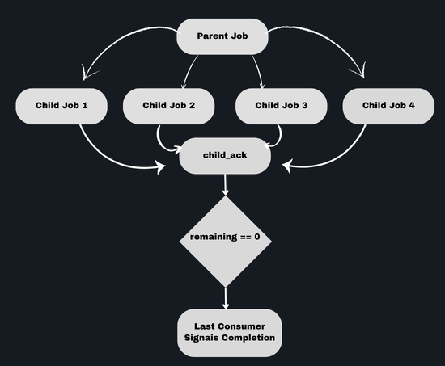

# OmniQ

  

OmniQ is a job queue built around a single idea: **keep all queue semantics centralized, deterministic, and atomic**.

Instead of reimplementing behavior in each client, OmniQ defines its core operations in **Lua**, so **every language behaves exactly the same**. This makes execution **predictable**, avoids **race conditions**, and keeps the system **consistent under concurrency**.

At the same time, it supports practical needs such as **controlled parallelism (via groups)**, **fair scheduling (round-robin)**, and **dependent workloads (parent/child jobs)**, without adding unnecessary complexity.

------------------------------------------------------------------------------

## Description

OmniQ provides a consistent model for background job processing across different runtimes. Instead of embedding queue logic in each language implementation, the core behavior is defined through Lua scripts, ensuring that all clients behave identically.

The system is built around a few key principles:

- Deterministic and atomic operations  
- Fair job scheduling across independent workloads  
- Controlled parallelism  
- Support for dependent (child) jobs  

------------------------------------------------------------------------------

## Implementations

You can run OmniQ using one of the existing implementations:

- **Python:** https://github.com/not-empty/omniq-python  
- **Go:** https://github.com/not-empty/omniq-go  
- **Node.js:** https://github.com/not-empty/omniq-node
- **PHP:** https://github.com/not-empty/omniq-php  

Or implement it yourself in any language capable of executing Lua scripts against the backing datastore (typically Redis).

------------------------------------------------------------------------------

## Core Concepts

### Lua (Atomic & Agnostic Operations)

All queue operations are executed through Lua scripts.

This guarantees:

- **Atomicity:** each operation runs as a single, indivisible unit  
- **Consistency:** no race conditions between consumers  
- **Agnostic behavior:** every language implementation shares the same logic  

This approach removes discrepancies between clients and ensures that queue semantics remain identical regardless of the runtime.

------------------------------------------------------------------------------

## Group × Parallel Limit

Jobs can be assigned to groups, where each group defines its own maximum number of concurrent executions.

This allows:

- Isolation between different workloads  
- Protection against resource exhaustion  
- Fine-grained concurrency control  

Consumers will only reserve jobs from a group if its parallel limit has not been reached.

------------------------------------------------------------------------------

## Round Robin (Fairness)

OmniQ uses a round-robin strategy when selecting jobs across groups.

Instead of draining one group entirely, the scheduler cycles between groups, ensuring:

- Fair distribution of processing time  
- No starvation of smaller or slower queues  
- Balanced throughput across all workloads  

------------------------------------------------------------------------------

## Child Jobs

The diagram below illustrates how OmniQ handles parent/child relationships between jobs:

OmniQ allows a parent job to spawn multiple child jobs and remain dependent on their completion. Instead of treating jobs as isolated units, this model enables coordinated execution across related tasks.

This is particularly useful for:

- Multi-step workflows  
- Parallel execution of sub-tasks  
- Explicit synchronization through child acknowledgements  

The child job lifecycle is managed through dedicated operations such as `child_init` (to initialize children) and `child_ack` (to track their completion), allowing the parent job to progress only when all required child jobs are resolved.

------------------------------------------------------------------------------

## Lua Actions

The following operations define the full behavior of the queue. All of them are executed atomically via Lua:

| Action             | Description                                   |
|--------------------|-----------------------------------------------|
| ack_fail           | Mark a job as failed and update its state     |
| ack_success        | Mark a job as successfully completed          |
| child_ack          | Register completion of a child job            |
| child_init         | Initialize child jobs for a parent            |
| enqueue            | Insert a new job into the queue               |
| heartbeat          | Update job execution heartbeat                |
| pause              | Pause processing for a queue or group         |
| promoted_delay     | Move delayed jobs into the ready state        |
| reap_expired       | Clean up expired or abandoned jobs            |
| remove_job         | Remove a specific job from the system         |
| remove_jobs_batch  | Remove multiple jobs in a single operation    |
| reserve            | Reserve the next available job for processing |
| resume             | Resume a paused queue or group                |
| retry_failed       | Retry a previously failed job                 |
| retry_failed_batch | Retry multiple failed jobs                    |

------------------------------------------------------------------------------

## Notes

- OmniQ does not enforce a specific transport or consumer model, it only defines queue semantics.  
- The backing datastore is typically Redis due to native Lua support and atomic execution guarantees.  
- Each language implementation is expected to be a thin layer over the Lua scripts.  

------------------------------------------------------------------------------

## License

See LICENSE file.
